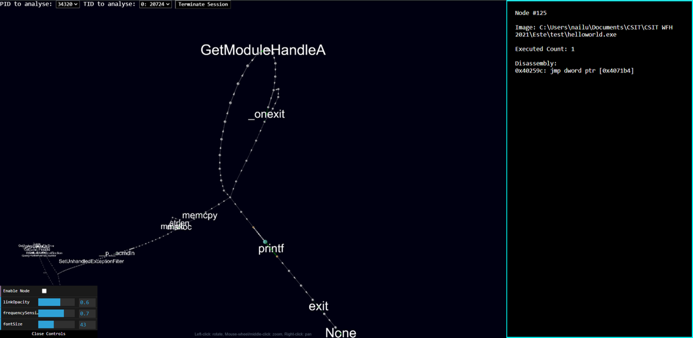

# Este

Este is an experimental tool in very early development that visualizes the dynamic runtime of a binary via instrumentation. Currently supports X86, X86_64 on Windows.

## Build Instructions

Open `x64_x86 Cross Tools Command Prompt for VS 2019`, available from a VS2019 install with the `Desktop Development with C++` package.

```batch
:: Clone repository
git clone --recursive https://github.com/JuliaPoo/Este

:: Unzip pintool
cd Este\Este\extLibs
7z x pin-3.18-98332-gaebd7b1e6-msvc-windows.zip

:: build Este in x86 and x64
:: build files are written to .Este/build folder
:: Alternatively, open `Este.sln` in Visual Studio 2019, 
:: set the build configuration to either `Release x86` or `Release x64` and build.
cd ..\
msbuild /property:Configuration=Release /property:Platform="x86"
msbuild /property:Configuration=Release /property:Platform="x64"
```

## Getting Started

1. Move to this repository's root directory
2. Edit [./este-config.toml](./este-config.toml) file and set the attribute `binary-whitelist` to the target binaries.
    - E.g. `binary-whitelist = ["test/helloworld.exe"]`
    - Read `./este-config.toml` for more details.
3. Run `run <process name> <process arguments>`
    - E.g. `run test/helloworld.exe`
4. Wait for visualization to appear in a tab on a browser

For more details refer to the [Developer's Manual](./docs/Developers-Manual.md)


